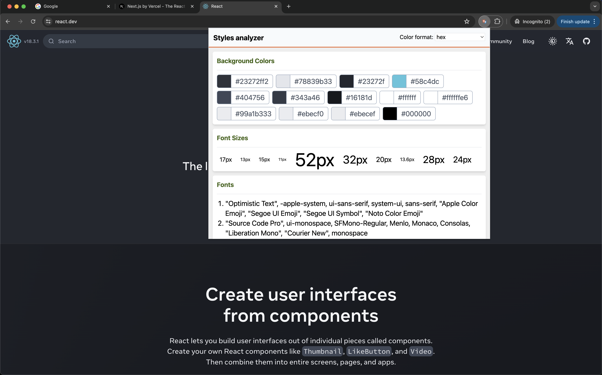

# Styles Analyzer Chrome extension

Built this while working on the design system at work. Needed to know what the existing colors and fonts are for all projects since the original figma files were not available.

1. Get style information about any website
2. Click to copy any of the styles
3. Three different formats for colors

 

 

## Demo Video:

https://github.com/supercoder123/styles-analyzer-chrome-extension/assets/16488390/aba85ff3-8867-4c27-bc7d-820fd67550f2

